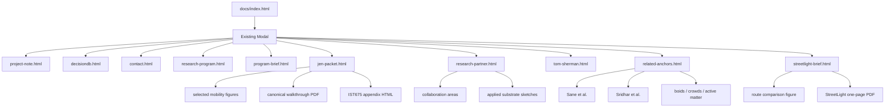

# Private Gallery Specification

## Purpose

This document defines the first gallery / packet architecture for `aimez` using the site's existing modal note pattern. The user explicitly chose:

- keep the homepage spare
- do not surface the gallery publicly first
- use the existing notes/modal pattern later
- stage Jen-facing materials privately inside `aimez` before promoting any part of them onto the public site

This specification is therefore about internal architecture and future implementation sequencing, not immediate public deployment.

## Existing site constraint

The homepage at [`docs/index.html`](/Users/gilraitses/aimez/docs/index.html) currently exposes three buttons that open note pages in an iframe modal:

- `notes/project-note.html`
- `notes/decisiondb.html`
- `notes/contact.html`

This is the correct architectural pattern to preserve in the first richer materialization. There is no build pipeline, no CMS, and no gallery component system. The gallery should therefore be one or more additional note pages plus an asset folder, not a new app framework.

## Phase-1 gallery decision

No gallery page is created in phase 1. Instead, phase 1 defines:

1. what the first private gallery should contain
2. how the files should be organized inside `aimez`
3. what must be true before the gallery can become public

## Proposed private gallery architecture

### New future note pages

When implemented (phase 3), add:

- `docs/notes/research-program.html`
- `docs/notes/jen-packet.html`
- `docs/notes/related-anchors.html`
- `docs/notes/program-brief.html`
- `docs/notes/tom-sherman.html`

These are note pages, not standalone top-level routes. They should open via the existing modal pattern.

### New future asset folders

When implemented (phase 3), add:

- `docs/assets/gallery/`
  - `mobility/`
  - `cv-pipeline/`
  - `appendix/`
  - `documents/`

This keeps the figure assets separate from the site chrome assets already under `docs/assets/`.

## First materials to stage

The first private gallery should contain the smallest set of materials that make the program legible to a reader like Jen without requiring them to parse the entire IST 675 package.

### Group 1. Program overview

Target note: `research-program.html`

Purpose:
- explain what `aimez` is in its updated form
- connect coherence diagnostics to structure-aware intelligence research
- name the mobility substrate as the first demonstrated applied instance
- preview the cross-domain anchors without overloading the page

Content types:
- 3 to 5 short sections
- 1 or 2 representative figures
- links outward to the fuller packet

### Group 1b. Program brief

Target note: `program-brief.html`

Purpose:
- provide the most polished private top-down overview of the research program
- serve conference, grant, paper-submission, and general PR conversations without naming any one funder or sponsor
- sit one layer above the Jen packet in polish and one layer below the homepage in exposure

Content types:
- 5 to 7 short sections
- 2 to 3 representative figures
- one short philosophy / direction paragraph that can carry future-facing language with more care than the homepage
- selective links to the background report, walkthrough PDF, and validation brief

### Group 2. Jen-facing packet

Target note: `jen-packet.html`

Purpose:
- house the current Jen email context in a reusable site-local form
- present the packet as a research-program overview, not as a personal email archive

First staged materials:
- one short memo summarizing the program
- links to the latest Jen email draft (or a distilled page version)
- link to the canonical figure walkthrough PDF
- link to the IST 675 appendix HTML if it remains outside `aimez`
- 3 to 5 selected mobility figures with one-sentence captions

### Group 3. Related anchors

Target note: `related-anchors.html`

Purpose:
- explain why the Sane and Sridhar papers matter to the program
- give the cross-domain bridge a home without forcing it into homepage copy

First staged materials:
- one short section on Sharpness Dimension / Edge of Stability
- one short section on Allocentric Flocking
- one short section on active matter / crowds / boids as communication scaffold
- one explicit “what transfers / what does not transfer” table or equivalent

### Group 4. Bounded external-validation notes

Target note: `streetlight-brief.html`

Purpose:
- house narrow, audience-specific disclosures for external data or validation conversations
- keep the page inside the `notes/` surface but outside homepage navigation
- present a bounded research use case without exposing the broader diagnostic-infrastructure layer

First staged materials:
- one StreetLight-facing validation brief for the Midtown pedestrian-routing substrate
- one route-comparison figure
- one downloadable one-page PDF brief
- one small patent-status footer that discloses the existence of a filed provisional without importing claim language

### Group 5. Research-partner packet

Target note: `research-partner.html`

Purpose:
- house a collaborator-facing packet for readers who should see more than a vendor but less than an advisor
- position `aimez` as a serious cross-domain research home with concrete applied substrates, figure evidence, and a collaboration surface
- support colleagues like Kasey Laurent, where the right framing is research alignment and future collaboration, not justification or validation procurement

First staged materials:
- one short research-program memo
- selected figures from the mobility substrate
- one section on cross-domain relevance and adjacent application areas
- one section on collaboration surfaces (what kinds of methods, systems, and questions the program wants collaborators for)
- one section on where the current work is intentionally bounded

### Group 6. Creative / media-theory packet

Target note: `tom-sherman.html`

Purpose:
- support creative-world and media-theory readers who should receive a conceptually rich but non-technical entry point
- frame the program through time-based media, attention, environment as representation, and information environments
- avoid the advisor packet's justificatory tone and the collaborator packet's methods-first tone

First staged materials:
- one concrete routing figure
- the flocking / active-matter video bridge
- short text connecting environment-as-media, modelled scenes, and time-based structure
- light links to the research-program and related-anchors pages

## Minimum viable figure set for the private gallery

The first private gallery should not duplicate the full 42-page walkthrough. It should stage a smaller figure set:

1. shortest-vs-sigma route comparison
2. camera-derived stress field
3. cross-street capacity overlay
4. one CV pipeline figure
5. optionally one redistribution figure

This is enough to make the substrate legible without drowning the reader in appendix material.

## Proposed information hierarchy

## Visibility rules

### Private-first

Before public exposure:

- pages may exist without homepage buttons
- URLs can be shared directly with trusted readers
- the content may be rough so long as it is internally coherent
- audience-specific pages such as `streetlight-brief.html` remain intentionally unlinked from homepage navigation
- audience-specific pages such as `research-partner.html` remain intentionally unlinked from homepage navigation until the collaboration ask is sharper and the figure set is pruned
- `program-brief.html` may exist privately first even though it is the most polished of the packet surfaces

### Public-ready

Before adding a button on the homepage:

- the page must be written as a stable research-program surface, not as a personal working note
- all external links must resolve
- the figure set must be pruned
- no page should assume the reader has already read the IST 675 paper or seen the slide deck

## What should not be staged first

Do not begin with:

- the full canonical figure walkthrough as HTML
- every figure from the demonstration package
- every cross-domain anchor in one page
- the full synapsin / active-matter bridge
- external-data-provider pages linked from the homepage before their disclosure boundaries have been checked

The first private gallery should be smaller, clearer, and selective.

## Dependencies for later implementation

When phase 3 begins, implementation will need:

1. a distilled program memo from `identity_reorg_plan.md`
2. anchor summaries from `theory_anchor_map.md`
3. the selected figure inventory and paths
4. a decision on whether to copy the Jen packet's PDFs into `aimez/docs/assets/gallery/documents/` or link to them externally

## Success condition

The gallery is successful when a Jen-like reader can answer three questions after ten minutes:

1. what is this program trying to understand?
2. what actual artifact demonstrates that it can do something real?
3. why do these new theory anchors matter to that artifact?

If the gallery cannot answer those three quickly, it is too large or too diffuse.
